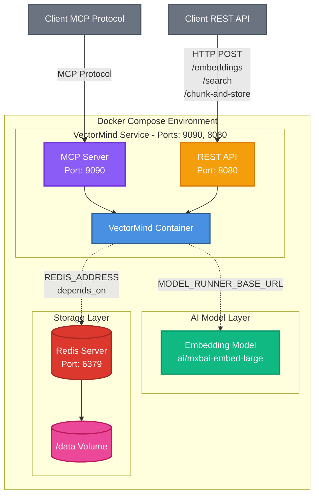
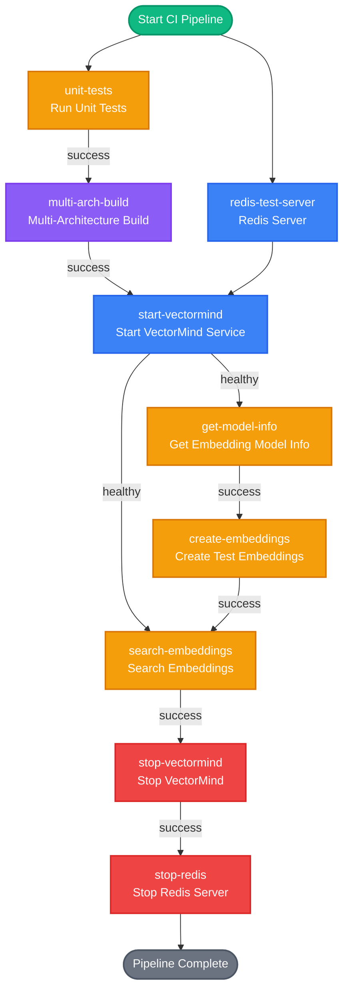

# VectorMind
> A text RAG (Retrieval Augmented Generation) System based on Redis with REST API endpoints and MCP (Model Context Protocol) server support.

## What is VectorMind?

VectorMind is a lightweight vector database service that provides semantic search capabilities using Redis as the backend storage. It creates embeddings from text content and enables similarity-based search operations.

### Key Features

- **Dual Interface**: Exposes both REST API (port 8080) and MCP server (port 9090) for flexibility
- **Vector Storage**: Uses Redis with HNSW (Hierarchical Navigable Small World) indexing for efficient similarity search
- **Embedding Support**: For example: creates embeddings using the `ai/mxbai-embed-large` model
- **Document Management**: Store documents with optional labels and metadata
- **Document Chunking**: Automatically split long documents into overlapping chunks for better semantic search
- **Similarity Search**: Find similar documents based on text queries with configurable distance thresholds and label filtering

### Architecture

VectorMind consists of:
- **Redis Server**: Stores embeddings and provides vector search capabilities via RediSearch
- **VectorMind Service**: Go application that handles embedding generation and exposes APIs
- **Embedding Model**: For example, it uses `ai/mxbai-embed-large` model for text embeddings (configurable)



## Getting Started

### Prerequisites

- Docker, Docker Model Runner and Docker Agentic Compose

### Starting VectorMind

1. **Using Docker Compose** (recommended):

**Create** a `compose.yml` file with the following content:
```yaml
services:

  redis-server:
    image: redis:8.2.3-alpine3.22
    environment: 
      - REDIS_ARGS=--save 30 1
    ports:
      - 6379:6379
    volumes:
      - ./data:/data

  vectormind-tests:
    image: k33g/vectormind:0.0.3
    ports:
      - 9090:9090
      - 8080:8080
    environment:
      REDIS_INDEX_NAME: vectormind_index
      REDIS_ADDRESS: redis-server:6379
      REDIS_PASSWORD: ""

      MCP_HTTP_PORT: 9090
      API_REST_PORT: 8080

    models:
      embedding-model:
        endpoint_var: MODEL_RUNNER_BASE_URL
        model_var: EMBEDDING_MODEL

    depends_on:
      redis-server:
        condition: service_started

models:

  embedding-model:
    model: ai/mxbai-embed-large
```

**Run** the following command to start **VectorMind**:
```bash
docker compose up -d
```

This will start:
- Redis server on port `6379`
- VectorMind MCP server on port `9090`
- VectorMind REST API on port `8080`

2. **Environment Variables**:

The compose file automatically configures:
- `REDIS_INDEX_NAME`: vectormind_index
- `REDIS_ADDRESS`: redis-server:6379
- `MCP_HTTP_PORT`: 9090
- `API_REST_PORT`: 8080
- `MODEL_RUNNER_BASE_URL`: Set via models configuration
- `EMBEDDING_MODEL`: ai/mxbai-embed-large

### Verifying the Installation

Check if VectorMind is running:

```bash
curl http://localhost:8080/health
```

Expected response:
```json
{
  "status": "healthy",
  "server": "mcp-vectormind-server"
}
```

## How to Use VectorMind

### REST API Usage

#### 1. Get Embedding Model Information

Get information about the embedding model being used:

```bash
curl http://localhost:8080/embedding-model-info
```

Response:
```json
{
  "success": true,
  "model_id": "ai/mxbai-embed-large",
  "dimension": 1024
}
```

This endpoint returns:
- `success`: Boolean indicating if the request was successful
- `model_id`: The identifier of the embedding model being used
- `dimension`: The dimension of the embedding vectors

#### 2. Create Embeddings

Store text content with optional labels and metadata:

```bash
curl -X POST http://localhost:8080/embeddings \
    -H "Content-Type: application/json" \
    -d '{
        "content": "Squirrels run in the forest",
        "label": "animals",
        "metadata": "id=animals_1"
    }'

curl -X POST http://localhost:8080/embeddings \
    -H "Content-Type: application/json" \
    -d '{
        "content": "Birds fly in the sky",
        "label": "animals",
        "metadata": "id=animals_2"
    }'

curl -X POST http://localhost:8080/embeddings \
    -H "Content-Type: application/json" \
    -d '{
        "content": "Frogs swim in the pond",
        "label": "animals",
        "metadata": "id=animals_3"
    }'

curl -X POST http://localhost:8080/embeddings \
    -H "Content-Type: application/json" \
    -d '{
        "content": "Fishes swim in the sea",
        "label": "animals",
        "metadata": "id=animals_4"
    }'
```

Response:
```json
{"id":"doc:b1c36710-9d94-41cb-abfc-aa404b896d1f","content":"Squirrels run in the forest","label":"animals","metadata":"id=animals_1","created_at":"2025-11-09T08:36:01.962629337Z","success":true}
{"id":"doc:fbc259cc-eb8d-425e-a444-d4f5b26400cb","content":"Birds fly in the sky","label":"animals","metadata":"id=animals_2","created_at":"2025-11-09T08:36:02.093359462Z","success":true}
{"id":"doc:0154fc6d-887b-4af2-a5a7-c8b37183554f","content":"Frogs swim in the pond","label":"animals","metadata":"id=animals_3","created_at":"2025-11-09T08:36:02.247079753Z","success":true}
{"id":"doc:3953dfdd-2a92-48de-b61b-0119c9d106fc","content":"Fishes swim in the sea","label":"animals","metadata":"id=animals_4","created_at":"2025-11-09T08:36:02.367855295Z","success":true}
```

#### 3. Search for Similar Documents

Find documents similar to a query text:

```bash
curl -X POST http://localhost:8080/search \
  -H "Content-Type: application/json" \
  -d '{
    "text": "Which animals swim?",
    "max_count": 3,
    "distance_threshold": 0.7
  }'

curl -X POST http://localhost:8080/search \
  -H "Content-Type: application/json" \
  -d '{
    "text": "Where are the squirrels?",
    "max_count": 3,
    "distance_threshold": 0.7
  }'

curl -X POST http://localhost:8080/search \
  -H "Content-Type: application/json" \
  -d '{
    "text": "What can be found in the pond?",
    "max_count": 3,
    "distance_threshold": 0.7
  }'
```

Response:
```json
{"results":[{"id":"doc:050c7cee-5891-4052-a3c9-40f2bd3abff7","content":"Fishes swim in the sea","distance":0.5175167322158813},{"id":"doc:efe2868d-3330-452c-ac2a-0e835caecdc9","content":"Frogs swim in the pond","distance":0.6700224280357361}],"success":true}
{"results":[{"id":"doc:14e7a8fb-78e5-4fe7-8969-7559b7cd9752","content":"Squirrels run in the forest","distance":0.48874980211257935}],"success":true}
{"results":[{"id":"doc:efe2868d-3330-452c-ac2a-0e835caecdc9","content":"Frogs swim in the pond","distance":0.6417693495750427}],"success":true}
```

**Parameters**:
- `text` (required): The search query
- `max_count` (optional): Maximum number of results (default: 5)
- `distance_threshold` (optional): Maximum distance to filter results (lower = more similar)

#### 4. Search for Similar Documents filtered by Label

```bash
curl -X POST http://localhost:8080/search_with_label \
  -H "Content-Type: application/json" \
  -d '{
    "text": "What lives in the forest?",
    "label": "animals",
    "max_count": 5,
    "distance_threshold": 0.8
  }'
```

**Parameters**:
- `text` (required): The search query
- `label` (required): The label to filter results by
- `max_count` (optional): Maximum number of results (default: 5)
- `distance_threshold` (optional): Maximum distance to filter results (**lower = more similar**)

#### 5. Chunk and Store Documents

Chunk a long document into smaller pieces with overlap and store all chunks with the same label and metadata:

```bash
# Read the document content and escape it for JSON
DOCUMENT_CONTENT=$(cat document.md | jq -Rs .)

curl -X POST http://localhost:8080/chunk-and-store \
  -H "Content-Type: application/json" \
  -d "{
    \"document\": ${DOCUMENT_CONTENT},
    \"label\": \"my-label\",
    \"metadata\": \"category=documentation\",
    \"chunk_size\": 1024,
    \"overlap\": 256
  }"
```

**Parameters**:
- `document` (required): The document content to chunk and store
- `label` (optional): Label to apply to all chunks
- `metadata` (optional): Metadata to apply to all chunks
- `chunk_size` (required): Size of each chunk in characters (must be ≤ embedding dimension)
- `overlap` (required): Number of characters to overlap between chunks (must be < chunk_size)

**Response**:
```json
{
  "success": true,
  "chunk_ids": ["doc:uuid-1", "doc:uuid-2", "doc:uuid-3"],
  "chunks_stored": 3,
  "created_at": "2025-11-30T10:30:00Z"
}
```

This endpoint is useful for:
- Processing long documents that exceed embedding model limits
- Creating overlapping chunks for better context preservation
- Batch storing multiple chunks with consistent labeling

#### 6. Split and Store Markdown Sections

Split a markdown document by sections (headers like #, ##, ###) and store all sections with embeddings. Sections larger than embedding dimension are automatically subdivided while preserving the section header:

```bash
# Read the markdown document and escape it for JSON
MARKDOWN_CONTENT=$(cat document.md | jq -Rs .)

curl -X POST http://localhost:8080/split-and-store-markdown-sections \
  -H "Content-Type: application/json" \
  -d "{
    \"document\": ${MARKDOWN_CONTENT},
    \"label\": \"documentation\",
    \"metadata\": \"project=vectormind\"
  }"
```

**Parameters**:
- `document` (required): The markdown document content to split and store
- `label` (optional): Label to apply to all sections/chunks
- `metadata` (optional): Metadata to apply to all sections/chunks

**Response**:
```json
{
  "success": true,
  "chunk_ids": ["doc:uuid-1", "doc:uuid-2", "doc:uuid-3"],
  "chunks_stored": 3,
  "created_at": "2025-11-30T10:30:00Z"
}
```

**How it works**:
- Splits the markdown document by headers (# ## ### etc.)
- Each section is stored as a separate chunk
- If a section exceeds the embedding dimension, it is automatically subdivided
- **Important**: When subdivided, each sub-chunk (except the first) will have the section header prepended to preserve context
- All chunks share the same label and metadata

**Example**: If a section "## Introduction to Vectors" is 3000 characters long and exceeds the embedding dimension (1024), it will be split into 3 sub-chunks:
1. `## Introduction to Vectors\n\n[first 1024 chars of content]`
2. `## Introduction to Vectors\n\n[next 1024 chars of content]`
3. `## Introduction to Vectors\n\n[remaining content]`

This endpoint is useful for:
- Processing structured markdown documentation
- Preserving semantic context through section headers
- Automatic handling of large sections without manual chunking

#### 7. Split and Store with Custom Delimiter

Split a document by a custom delimiter and store all chunks with embeddings. Chunks larger than embedding dimension are automatically subdivided while preserving the first 2 non-empty lines as context:

```bash
# Read the document and escape it for JSON
DOCUMENT_CONTENT=$(cat startrek.txt | jq -Rs .)

curl -X POST http://localhost:8080/split-and-store-with-delimiter \
  -H "Content-Type: application/json" \
  -d "{
    \"document\": ${DOCUMENT_CONTENT},
    \"delimiter\": \"-----\",
    \"label\": \"star-trek-diseases\",
    \"metadata\": \"source=federation-medical-database\"
  }"
```

**Parameters**:
- `document` (required): The document content to split and store
- `delimiter` (required): The delimiter used to split the document (e.g., "-----", "###", etc.)
- `label` (optional): Label to apply to all chunks
- `metadata` (optional): Metadata to apply to all chunks

**Response**:
```json
{
  "success": true,
  "chunk_ids": ["doc:uuid-1", "doc:uuid-2", "doc:uuid-3"],
  "chunks_stored": 3,
  "created_at": "2025-11-30T10:30:00Z"
}
```

**How it works**:
- Splits the document by the specified delimiter
- Each chunk is stored as a separate document
- If a chunk exceeds the embedding dimension, it is automatically subdivided
- **Important**: When subdivided, the first 2 non-empty lines of the original chunk are prepended to each sub-chunk (except the first) to preserve context
- All chunks share the same label and metadata

**Example**: If a chunk starts with:
```
Disease: Andorian Ice Plague
Provenance: Andoria, Andorian Empire
```
and exceeds the embedding dimension, it will be split into sub-chunks where each sub-chunk (except the first) will start with:
```
Disease: Andorian Ice Plague
Provenance: Andoria, Andorian Empire

[remaining content]
```

This endpoint is useful for:
- Processing structured data with custom delimiters
- Maintaining document context through key identifying lines
- Working with datasets that use consistent separators (CSV-like, log files, etc.)
- Automatic handling of large records without manual chunking

#### 8. Split and Store Markdown with Hierarchy (🧪 EXPERIMENTAL)

Split a markdown document by headers while preserving hierarchical context. Each chunk includes structured metadata with TITLE, HIERARCHY, and CONTENT fields. Chunks larger than embedding dimension are automatically subdivided:

```bash
# Read the markdown document and escape it for JSON
MARKDOWN_CONTENT=$(cat document.md | jq -Rs .)

curl -X POST http://localhost:8080/split-and-store-markdown-with-hierarchy \
  -H "Content-Type: application/json" \
  -d "{
    \"document\": ${MARKDOWN_CONTENT},
    \"label\": \"documentation\",
    \"metadata\": \"project=vectormind\"
  }"
```

**Parameters**:
- `document` (required): The markdown document content to split and store
- `label` (optional): Label to apply to all chunks
- `metadata` (optional): Metadata to apply to all chunks

**Response**:
```json
{
  "success": true,
  "chunk_ids": ["doc:uuid-1", "doc:uuid-2", "doc:uuid-3"],
  "chunks_stored": 3,
  "created_at": "2025-11-30T10:30:00Z"
}
```

**How it works**:
- Parses the markdown document and extracts headers with their hierarchical relationships
- Each chunk is formatted with:
  - `TITLE:` The header prefix (e.g., `##`) and title
  - `HIERARCHY:` The full hierarchical path (e.g., `Introduction > Getting Started > Installation`)
  - `CONTENT:` The section content
- If a chunk exceeds the embedding dimension, it is automatically subdivided
- All chunks share the same label and metadata

**Example chunk format**:
```
TITLE: ## Installation
HIERARCHY: Getting Started > Installation
CONTENT: To install VectorMind, follow these steps...
```

**Use cases**:
- Processing documentation with deep hierarchical structure
- Maintaining semantic context through parent-child relationships
- Searching within specific document hierarchies
- Preserving document navigation structure in vector databases

**Note**: This feature is experimental and the chunk format may change in future versions.

### MCP Usage

VectorMind exposes the following MCP tools:

#### 1. `about_vectormind`
Provides information about the VectorMind MCP server.

**Parameters**: None

#### 2. `create_embedding`
Create and store an embedding from text content with optional label and metadata.

**Parameters**:
- `content` (required): The text content to create an embedding from
- `label` (optional): Label/tag for the document
- `metadata` (optional): Metadata for the document

**Returns**: JSON object with document ID, content, label, metadata, and creation timestamp

#### 3. `similarity_search`
Search for similar documents based on text query. Returns documents ordered by similarity (closest first).

**Parameters**:
- `text` (required): The text query to search for similar documents
- `max_count` (optional): Maximum number of results to return (default: 1)
- `distance_threshold` (optional): Only returns documents with distance <= threshold

**Returns**: JSON object with array of matching documents including ID, content, label, metadata, distance, and created_at

#### 4. `get_embedding_model_info`
Get information about the embedding model being used, including the model ID and dimension.

**Parameters**: None

**Returns**: JSON object with:
- `model_id`: The identifier of the embedding model being used
- `dimension`: The dimension of the embedding vectors

**Example response**:
```json
{
  "model_id": "ai/mxbai-embed-large",
  "dimension": 1024
}
```

#### 5. `similarity_search_with_label`
Search for similar documents filtered by label. Returns documents ordered by similarity (closest first).

**Parameters**:
- `text` (required): The text query to search for similar documents
- `label` (required): The label to filter documents by
- `max_count` (optional): Maximum number of results to return (default: 1)
- `distance_threshold` (optional): Only returns documents with distance <= threshold

**Returns**: JSON object with array of matching documents including ID, content, label, metadata, distance, and created_at

#### 6. `chunk_and_store`
Chunk a document into smaller pieces with overlap and store all chunks with embeddings. All chunks will share the same label and metadata.

**Parameters**:
- `document` (required): The document content to chunk and store
- `label` (optional): Label to apply to all chunks
- `metadata` (optional): Metadata to apply to all chunks
- `chunk_size` (required): Size of each chunk in characters (must be ≤ embedding dimension)
- `overlap` (required): Number of characters to overlap between consecutive chunks (must be < chunk_size)

**Returns**: JSON object with:
- `success`: Boolean indicating if the operation was successful
- `chunk_ids`: Array of document IDs for all stored chunks
- `chunks_stored`: Number of chunks that were stored
- `created_at`: Timestamp of when the chunks were created

**Example response**:
```json
{
  "success": true,
  "chunk_ids": ["doc:abc-123", "doc:def-456", "doc:ghi-789"],
  "chunks_stored": 3,
  "created_at": "2025-11-30T10:30:00Z"
}
```

**Use cases**:
- Processing long documents that exceed embedding model limits
- Creating overlapping chunks for better semantic search
- Batch importing large text files with consistent metadata

#### 7. `split_and_store_markdown_sections`
Split a markdown document by sections (headers like #, ##, ###) and store all sections with embeddings. Sections larger than embedding dimension are automatically subdivided while preserving the section header.

**Parameters**:
- `document` (required): The markdown document content to split and store
- `label` (optional): Label to apply to all sections/chunks
- `metadata` (optional): Metadata to apply to all sections/chunks

**Returns**: JSON object with:
- `success`: Boolean indicating if the operation was successful
- `chunk_ids`: Array of document IDs for all stored chunks
- `chunks_stored`: Number of chunks that were stored
- `created_at`: Timestamp of when the chunks were created

**Example response**:
```json
{
  "success": true,
  "chunk_ids": ["doc:abc-123", "doc:def-456", "doc:ghi-789"],
  "chunks_stored": 3,
  "created_at": "2025-11-30T10:30:00Z"
}
```

**How it works**:
- Splits the markdown document by headers (# ## ### etc.)
- Each section is stored as a separate chunk
- If a section exceeds the embedding dimension, it is automatically subdivided
- **Important**: When subdivided, each sub-chunk (except the first) will have the section header prepended to preserve context
- All chunks share the same label and metadata

**Example**: If a section "## Deep Dive into the Monsters of Aethelgard" is too large, it will be split into multiple sub-chunks, each starting with "## Deep Dive into the Monsters of Aethelgard" to maintain semantic context during similarity searches.

**Use cases**:
- Processing structured markdown documentation
- Preserving semantic context through section headers
- Automatic handling of large sections without manual chunking
- Maintaining document structure in vector databases

#### 8. `split_and_store_with_delimiter`
Split a document by a custom delimiter and store all chunks with embeddings. Chunks larger than embedding dimension are automatically subdivided while preserving the first 2 non-empty lines as context.

**Parameters**:
- `document` (required): The document content to split and store
- `delimiter` (required): The delimiter used to split the document (e.g., "-----", "###", etc.)
- `label` (optional): Label to apply to all chunks
- `metadata` (optional): Metadata to apply to all chunks

**Returns**: JSON object with:
- `success`: Boolean indicating if the operation was successful
- `chunk_ids`: Array of document IDs for all stored chunks
- `chunks_stored`: Number of chunks that were stored
- `created_at`: Timestamp of when the chunks were created

**Example response**:
```json
{
  "success": true,
  "chunk_ids": ["doc:abc-123", "doc:def-456", "doc:ghi-789"],
  "chunks_stored": 3,
  "created_at": "2025-11-30T10:30:00Z"
}
```

**How it works**:
- Splits the document by the specified delimiter
- Each chunk is stored as a separate document
- If a chunk exceeds the embedding dimension, it is automatically subdivided
- **Important**: When subdivided, the first 2 non-empty lines of the original chunk are prepended to each sub-chunk (except the first) to preserve context
- All chunks share the same label and metadata

**Example**: Perfect for processing structured data like the Star Trek Federation Medical Database where each disease record is separated by "-----" and starts with identifying information like "Disease: Name" and "Provenance: Location".

**Use cases**:
- Processing structured data with custom delimiters
- Maintaining document context through key identifying lines
- Working with datasets that use consistent separators
- Medical databases, catalogs, or any structured text data
- Automatic handling of large records without manual chunking

#### 9. `split_and_store_markdown_with_hierarchy` (🧪 EXPERIMENTAL)

Split a markdown document by headers while preserving hierarchical context. Each chunk includes structured metadata with TITLE, HIERARCHY, and CONTENT fields. Chunks larger than embedding dimension are automatically subdivided.

**Parameters**:
- `document` (required): The markdown document content to split and store
- `label` (optional): Label to apply to all chunks
- `metadata` (optional): Metadata to apply to all chunks

**Returns**: JSON object with:
- `success`: Boolean indicating if the operation was successful
- `chunk_ids`: Array of document IDs for all stored chunks
- `chunks_stored`: Number of chunks that were stored
- `created_at`: Timestamp of when the chunks were created

**Example response**:
```json
{
  "success": true,
  "chunk_ids": ["doc:abc-123", "doc:def-456", "doc:ghi-789"],
  "chunks_stored": 3,
  "created_at": "2025-11-30T10:30:00Z"
}
```

**How it works**:
- Parses the markdown document and extracts headers with their hierarchical relationships
- Each chunk is formatted with:
  - `TITLE:` The header prefix (e.g., `##`) and title
  - `HIERARCHY:` The full hierarchical path (e.g., `Introduction > Getting Started > Installation`)
  - `CONTENT:` The section content
- If a chunk exceeds the embedding dimension, it is automatically subdivided
- All chunks share the same label and metadata

**Example chunk format**:
```
TITLE: ## Installation
HIERARCHY: Getting Started > Installation
CONTENT: To install VectorMind, follow these steps...
```

**Use cases**:
- Processing documentation with deep hierarchical structure
- Maintaining semantic context through parent-child relationships
- Searching within specific document hierarchies
- Preserving document navigation structure in vector databases

**Note**: This feature is experimental and the chunk format may change in future versions.

## Examples

### Use VectorMind with OpenAI JS SDK
> See [samples/openai-js-sdk](samples/openai-js-sdk)
```javascript
import OpenAI from "openai";

// OpenAI Client
const openai = new OpenAI({
	baseURL: "http://localhost:12434/engines/v1",
	apiKey: "i-love-docker-model-runner",
});

const VECTORMIND_API = "http://localhost:8080";

const chunks = [
	`# Orcs
	Orcs are savage, brutish humanoids with dark green skin and prominent tusks. 
	These fierce warriors inhabit dense forests where they hunt in packs, 
	using crude but effective weapons forged from scavenged metal and bone. 
	Their tribal society revolves around strength and combat prowess, 
	making them formidable opponents for any adventurer brave enough to enter their woodland domain.`,

	`# Dragons
	Dragons are magnificent and ancient creatures of immense power, soaring through the skies on massive wings. 
	These intelligent beings possess scales that shimmer like precious metals and breathe devastating elemental attacks. 
	Known for their vast hoards of treasure and centuries of accumulated knowledge, 
	dragons command both fear and respect throughout the realm. 
	Their aerial dominance makes them nearly untouchable in their celestial domain.`,

	`# Goblins
	Goblins are small, cunning creatures with mottled green skin and sharp, pointed ears. 
	Despite their diminutive size, they are surprisingly agile swimmers who have adapted to life around ponds and marshlands. 
	These mischievous beings are known for their quick wit and tendency to play pranks on unwary travelers. 
	They build elaborate underwater lairs connected by hidden tunnels beneath the murky pond waters.`,

	`# Krakens
	Krakens are colossal sea monsters with massive tentacles that can crush entire ships with ease. 
	These legendary creatures dwell in the deepest ocean trenches, surfacing only to hunt or when disturbed. 
	Their intelligence rivals that of the wisest sages, and their tentacles can stretch for hundreds of feet. 
	Sailors speak in hushed tones of these maritime titans, whose very presence can create devastating whirlpools 
	and tidal waves that reshape entire coastlines.`,
];

// Function to create embeddings
async function createEmbedding(content, label = "", metadata = "") {
	const response = await fetch(`${VECTORMIND_API}/embeddings`, {
		method: "POST",
		headers: {
			"Content-Type": "application/json",
		},
		body: JSON.stringify({
			content,
			label,
			metadata,
		}),
	});

	return await response.json();
}

// Function to search for similar documents
async function searchSimilar(text, maxCount = 5, distanceThreshold = 0.7) {
	const response = await fetch(`${VECTORMIND_API}/search`, {
		method: "POST",
		headers: {
			"Content-Type": "application/json",
		},
		body: JSON.stringify({
			text,
			max_count: maxCount,
			distance_threshold: distanceThreshold,
		}),
	});

	return await response.json();
}

let userInput = "Tell me something about the dragons";

try {
	// Create embeddings from chunks
	console.log("Creating embeddings...\n");

	for (const chunk of chunks) {
		const result = await createEmbedding(chunk, "fantasy-creatures", "");
		console.log("Created embedding:", result);
	}

	// Search for similar documents
	console.log("\n\nSearching for similar documents...\n");

	const searchResult = await searchSimilar(userInput, 1, 0.7);
	console.log("Search results:\n", JSON.stringify(searchResult, null, 2));

	const documents = searchResult.results.map(r => r.content).join("\n");


	const completion = await openai.chat.completions.create({
		model: "hf.co/menlo/jan-nano-gguf:q4_k_m",
		messages: [
      { role: "system", content: "Using the following documents:" },
      { role: "system", content: "documents:\n"+ documents },
      { role: "user", content: "userInput" }
    ],
		stream: true,
	});

  console.log("=".repeat);

	for await (const chunk of completion) {
		process.stdout.write(chunk.choices[0].delta.content || "");
	}
} catch (error) {
	console.error("Error:", error);
}
```

### Use VectorMind with OpenAI Golang SDK
> See [samples/openai-go-sdk](samples/openai-go-sdk)
```go
package main

import (
	"bytes"
	"context"
	"encoding/json"
	"fmt"
	"io"
	"log"
	"net/http"
	"strings"

	"github.com/openai/openai-go"
	"github.com/openai/openai-go/option"
)

const VECTORMIND_API = "http://localhost:8080"

// EmbeddingRequest représente la requête pour créer un embedding
type EmbeddingRequest struct {
	Content  string `json:"content"`
	Label    string `json:"label,omitempty"`
	Metadata string `json:"metadata,omitempty"`
}

// EmbeddingResponse représente la réponse de création d'embedding
type EmbeddingResponse struct {
	ID        string `json:"id"`
	Content   string `json:"content"`
	Label     string `json:"label"`
	Metadata  string `json:"metadata"`
	CreatedAt string `json:"created_at"`
	Success   bool   `json:"success"`
}

// SearchRequest représente la requête de recherche
type SearchRequest struct {
	Text              string  `json:"text"`
	MaxCount          int     `json:"max_count,omitempty"`
	DistanceThreshold float64 `json:"distance_threshold,omitempty"`
}

// SearchResult représente un résultat de recherche
type SearchResult struct {
	ID       string  `json:"id"`
	Content  string  `json:"content"`
	Distance float64 `json:"distance"`
}

// SearchResponse représente la réponse de recherche
type SearchResponse struct {
	Results []SearchResult `json:"results"`
	Success bool           `json:"success"`
}

// CreateEmbedding crée un embedding dans VectorMind
func CreateEmbedding(content, label, metadata string) (*EmbeddingResponse, error) {
	reqBody := EmbeddingRequest{
		Content:  content,
		Label:    label,
		Metadata: metadata,
	}

	jsonData, err := json.Marshal(reqBody)
	if err != nil {
		return nil, fmt.Errorf("erreur marshaling: %w", err)
	}

	resp, err := http.Post(VECTORMIND_API+"/embeddings", "application/json", bytes.NewBuffer(jsonData))
	if err != nil {
		return nil, fmt.Errorf("erreur requête: %w", err)
	}
	defer resp.Body.Close()

	body, err := io.ReadAll(resp.Body)
	if err != nil {
		return nil, fmt.Errorf("erreur lecture réponse: %w", err)
	}

	var result EmbeddingResponse
	if err := json.Unmarshal(body, &result); err != nil {
		return nil, fmt.Errorf("erreur unmarshaling: %w", err)
	}

	return &result, nil
}

// SearchSimilar recherche des documents similaires
func SearchSimilar(text string, maxCount int, distanceThreshold float64) (*SearchResponse, error) {
	reqBody := SearchRequest{
		Text:              text,
		MaxCount:          maxCount,
		DistanceThreshold: distanceThreshold,
	}

	jsonData, err := json.Marshal(reqBody)
	if err != nil {
		return nil, fmt.Errorf("erreur marshaling: %w", err)
	}

	resp, err := http.Post(VECTORMIND_API+"/search", "application/json", bytes.NewBuffer(jsonData))
	if err != nil {
		return nil, fmt.Errorf("erreur requête: %w", err)
	}
	defer resp.Body.Close()

	body, err := io.ReadAll(resp.Body)
	if err != nil {
		return nil, fmt.Errorf("erreur lecture réponse: %w", err)
	}

	var result SearchResponse
	if err := json.Unmarshal(body, &result); err != nil {
		return nil, fmt.Errorf("erreur unmarshaling: %w", err)
	}

	return &result, nil
}

func main() {

	baseURL := "http://localhost:12434/engines/llama.cpp/v1/"
	model := "hf.co/menlo/jan-nano-gguf:q4_k_m"

	client := openai.NewClient(
		option.WithBaseURL(baseURL),
		option.WithAPIKey(""),
	)

	ctx := context.Background()

	chunks := []string{
		`# Orcs
		Orcs are savage, brutish humanoids with dark green skin and prominent tusks.
		These fierce warriors inhabit dense forests where they hunt in packs,
		using crude but effective weapons forged from scavenged metal and bone.
		Their tribal society revolves around strength and combat prowess,
		making them formidable opponents for any adventurer brave enough to enter their woodland domain.`,

		`# Dragons
		Dragons are magnificent and ancient creatures of immense power, soaring through the skies on massive wings.
		These intelligent beings possess scales that shimmer like precious metals and breathe devastating elemental attacks.
		Known for their vast hoards of treasure and centuries of accumulated knowledge,
		dragons command both fear and respect throughout the realm.
		Their aerial dominance makes them nearly untouchable in their celestial domain.`,

		`# Goblins
		Goblins are small, cunning creatures with mottled green skin and sharp, pointed ears.
		Despite their diminutive size, they are surprisingly agile swimmers who have adapted to life around ponds and marshlands.
		These mischievous beings are known for their quick wit and tendency to play pranks on unwary travelers.
		They build elaborate underwater lairs connected by hidden tunnels beneath the murky pond waters.`,

		`# Krakens
		Krakens are colossal sea monsters with massive tentacles that can crush entire ships with ease.
		These legendary creatures dwell in the deepest ocean trenches, surfacing only to hunt or when disturbed.
		Their intelligence rivals that of the wisest sages, and their tentacles can stretch for hundreds of feet.
		Sailors speak in hushed tones of these maritime titans, whose very presence can create devastating whirlpools
		and tidal waves that reshape entire coastlines.`,
	}

	// Creation of embeddings
	fmt.Println("Creation of embeddings...")
	for _, chunk := range chunks {
		result, err := CreateEmbedding(chunk, "fantasy-creatures", "")
		if err != nil {
			fmt.Printf("Error when embedding: %v\n", err)
			continue
		}
		fmt.Printf("Embedding created: ID=%s, Success=%v\n", result.ID, result.Success)
	}

	// Search for similar documents
	fmt.Println("\n\nSearch for similar documents...")

	userInput := "Tell me something about the dragons"

	searchResult, err := SearchSimilar(userInput, 2, 0.7)
	if err != nil {
		fmt.Printf("Error search: %v\n", err)
	}

	fmt.Printf("Found: %d\n", len(searchResult.Results))

	var documents string

	for i, result := range searchResult.Results {
		fmt.Printf("  %d. Distance: %.4f\n", i+1, result.Distance)
		fmt.Printf("     ID: %s\n", result.ID)
		fmt.Printf("     Content: %s...\n", result.Content[:50])
		documents += result.Content + "\n"
	}

	fmt.Println(strings.Repeat("-", 50))
	fmt.Println("Chat Completion with retrieved documents as context:")

	messages := []openai.ChatCompletionMessageParamUnion{
		openai.SystemMessage("Using the following documents:"),
		openai.SystemMessage("documents:\n" + documents),
		openai.UserMessage(userInput),
	}

	param := openai.ChatCompletionNewParams{
		Messages:    messages,
		Model:       model,
		Temperature: openai.Opt(0.0),
	}

	stream := client.Chat.Completions.NewStreaming(ctx, param)

	for stream.Next() {
		chunk := stream.Current()
		// Stream each chunk as it arrives
		if len(chunk.Choices) > 0 && chunk.Choices[0].Delta.Content != "" {
			fmt.Print(chunk.Choices[0].Delta.Content)
		}
	}

	if err := stream.Err(); err != nil {
		log.Fatalln("Error with the completion:", err)
	}
}
```

### Use VectorMind with Golang MCP client
> See [samples/use-with-go-mcp-client](samples/use-with-go-mcp-client)
```go
package main

import (
	"context"
	"encoding/json"
	"fmt"
	"log"
	"strings"

	"github.com/mark3labs/mcp-go/client"
	"github.com/mark3labs/mcp-go/client/transport"
	"github.com/mark3labs/mcp-go/mcp"
)

type SearchResult struct {
	ID       string  `json:"id"`
	Content  string  `json:"content"`
	Distance float64 `json:"distance"`
}

type SearchResponse struct {
	Results []SearchResult `json:"results"`
	Success bool           `json:"success"`
}

var chunks = []string{
	`# Orcs
		Orcs are savage, brutish humanoids with dark green skin and prominent tusks.
		These fierce warriors inhabit dense forests where they hunt in packs,
		using crude but effective weapons forged from scavenged metal and bone.
		Their tribal society revolves around strength and combat prowess,
		making them formidable opponents for any adventurer brave enough to enter their woodland domain.`,

	`# Dragons
		Dragons are magnificent and ancient creatures of immense power, soaring through the skies on massive wings.
		These intelligent beings possess scales that shimmer like precious metals and breathe devastating elemental attacks.
		Known for their vast hoards of treasure and centuries of accumulated knowledge,
		dragons command both fear and respect throughout the realm.
		Their aerial dominance makes them nearly untouchable in their celestial domain.`,

	`# Goblins
		Goblins are small, cunning creatures with mottled green skin and sharp, pointed ears.
		Despite their diminutive size, they are surprisingly agile swimmers who have adapted to life around ponds and marshlands.
		These mischievous beings are known for their quick wit and tendency to play pranks on unwary travelers.
		They build elaborate underwater lairs connected by hidden tunnels beneath the murky pond waters.`,

	`# Krakens
		Krakens are colossal sea monsters with massive tentacles that can crush entire ships with ease.
		These legendary creatures dwell in the deepest ocean trenches, surfacing only to hunt or when disturbed.
		Their intelligence rivals that of the wisest sages, and their tentacles can stretch for hundreds of feet.
		Sailors speak in hushed tones of these maritime titans, whose very presence can create devastating whirlpools
		and tidal waves that reshape entire coastlines.`,
}

func main() {

	ctx := context.Background()

	// MCP client initialization
	fmt.Println("🚀 Initializing MCP StreamableHTTP client...")
	// Create HTTP transport
	httpURL := "http://localhost:9090/mcp"
	httpTransport, err := transport.NewStreamableHTTP(httpURL)
	if err != nil {
		log.Fatalf("Failed to create HTTP transport: %v", err)
	}
	// Create client with the transport
	mcpClient := client.NewClient(httpTransport)
	// Start the client
	if err := mcpClient.Start(ctx); err != nil {
		log.Fatalf("Failed to start client: %v", err)
	}

	initRequest := mcp.InitializeRequest{}
	initRequest.Params.ProtocolVersion = mcp.LATEST_PROTOCOL_VERSION
	initRequest.Params.ClientInfo = mcp.Implementation{
		Name:    "MCP-Go Simple Client Example",
		Version: "1.0.0",
	}
	initRequest.Params.Capabilities = mcp.ClientCapabilities{}

	_, err = mcpClient.Initialize(ctx, initRequest)
	if err != nil {
		log.Fatalf("Failed to initialize: %v", err)
	}

	// Tools listing
	toolsRequest := mcp.ListToolsRequest{}
	// Get the list of tools
	toolsResult, err := mcpClient.ListTools(ctx, toolsRequest)
	if err != nil {
		log.Fatalf("Failed to list tools: %v", err)
	}
	fmt.Println("🛠️  Available tools:")
	for _, tool := range toolsResult.Tools {
		fmt.Printf("- %s: %s\n", tool.Name, tool.Description)
	}

	// Create Embeddings with `create_embedding` MCP tool
	fmt.Println("\n\nCreation of embeddings...")
	for _, chunk := range chunks {
		request := mcp.CallToolRequest{
			Params: mcp.CallToolParams{
				Name: "create_embedding",
				Arguments: map[string]any{
					"content":  chunk,
					"label":    "fantasy-creatures",
					"metadata": "",
				},
			},
		}
		toolResponse, err := mcpClient.CallTool(ctx, request)
		if err != nil {
			fmt.Printf("Error when embedding: %v\n", err)
			continue
		}
		if toolResponse == nil || len(toolResponse.Content) == 0 {
			fmt.Printf("No response from embedding tool\n")
			continue
		}
		fmt.Println("🛠️  Tool response:", toolResponse.Content[0].(mcp.TextContent).Text)

	}

	fmt.Println(strings.Repeat("=", 50))
	fmt.Println("Search for similar documents...")

	userInput := "Tell me something about the dragons"

	searchRequest := mcp.CallToolRequest{
		Params: mcp.CallToolParams{
			Name: "similarity_search",
			Arguments: map[string]any{
				"text":               userInput,
				"max_count":          2,
				"distance_threshold": 0.7,
			},
		},
	}
	searchResponse, err := mcpClient.CallTool(ctx, searchRequest)
	if err != nil {
		log.Fatalf("Error search: %v", err)
	}
	if searchResponse == nil || len(searchResponse.Content) == 0 {
		log.Fatalf("No response from search tool")
	}

	searchResult := searchResponse.Content[0].(mcp.TextContent).Text

	// Parse the JSON response
	var response SearchResponse
	err = json.Unmarshal([]byte(searchResult), &response)
	if err != nil {
		log.Fatalf("Error parsing search result: %v", err)
	}

	// Loop through results
	fmt.Println("\n📋 Search Results:")
	for _, result := range response.Results {
		fmt.Printf("\nID: %s\n", result.ID)
		fmt.Printf("Distance: %f\n", result.Distance)
		fmt.Printf("Content: %s\n", result.Content)
		fmt.Println(strings.Repeat("-", 50))
	}
}
```

## Development and testing

**VectorMind** uses a local CI pipeline based on `Docker Compose` with the following files:

- Main pipeline: `compose.ci.yml`
- `compose.ci.redis-test-server.yml`
- `compose.ci.unit-tests.yml`
- `compose.ci.multi-arch-build.yml`
- `compose.ci.start-vectormind.yml` 
- `compose.ci.get-model-info.yml`
- `compose.ci.create-embeddings.yml`
- `compose.ci.search-embeddings.yml` 
- `compose.ci.stop-vectormind.yml` 
- `compose.ci.stop-redis.yml `       

**Start the CI pipeline**:
```bash
docker compose -f compose.ci.yml up --remove-orphans --build
```

**Stop the CI pipeline (in a clean way)**:
```bash
docker compose -f compose.ci.yml down
```

### Local CI Pipeline

The local CI pipeline is orchestrated using Docker Compose and follows this workflow:



### Pipeline Stages

1. **redis-test-server**: Starts Redis server for testing
2. **unit-tests**: Runs unit tests in short mode
3. **multi-arch-build**: Builds multi-architecture Docker image (depends on unit-tests success)
4. **start-vectormind**: Starts VectorMind service (depends on multi-arch-build success and redis-test-server)
5. **get-model-info**: Gets embedding model information (depends on start-vectormind healthy)
6. **create-embeddings**: Creates test embeddings (depends on start-vectormind healthy and get-model-info success)
7. **search-embeddings**: Tests embedding search functionality (depends on create-embeddings success and start-vectormind healthy)
8. **stop-vectormind**: Stops VectorMind service (depends on search-embeddings success)
9. **stop-redis**: Stops Redis server (depends on stop-vectormind success)